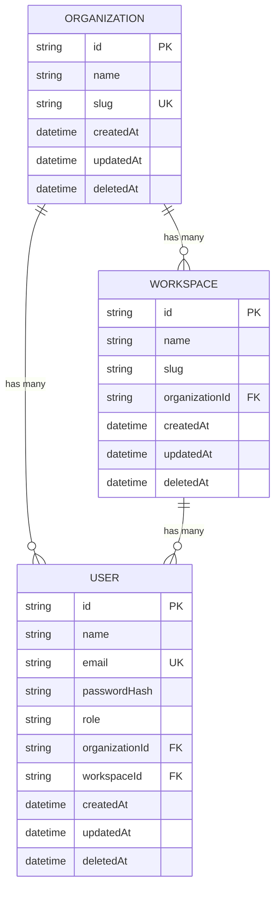

# Pulse Project Overview

## What Pulse Is

Pulse is a modern SaaS analytics and multi-tenant management platform built with Next.js 15 App Router, TypeScript, Tailwind CSS v4, shadcn/ui, Prisma ORM, NextAuth v5 (Auth.js), and a robust Role-Based Access Control (RBAC) system.

The application delivers three integrated experiences:

1. **Public Marketing & Product Landing Page** at `/`
2. **Authenticated Workspace Analytics Dashboard** at `/dashboard` (with sub-routes for Analytics, Customers, and Reports)
3. **Protected Administration Portal** at `/admin` (with sub-routes for User Management, Billing, and Organization Settings)

---

## Key Features & Capabilities

### 1. Public Marketing Flow
- Responsive landing page showcasing value propositions, interactive product previews, feature grids, billing tabs, and expandable FAQ accordions.
- **Session-Aware Navigation**: Navbar dynamically reflects auth state, offering Quick Sign In / Registration for guests and Avatar / Profile / Sign Out dropdowns for logged-in team members.
- Billing frequency switcher between monthly and yearly pricing plans.

### 2. Authentication & User Onboarding
- **NextAuth v5 (Auth.js)** authentication with secure JWT session handling.
- **Credentials Provider** backed by password hashing via `bcryptjs`.
- **Preconfigured Demo Accounts**: Instant 1-click credentials autofill on the login page for:
  - **Super Admin** (`nikhil@pulse.demo` / `password123`) — full workspace and administrative access.
  - **Manager** (`maya@pulse.demo` / `password123`) — workspace read and analytics access.
  - **Viewer** (`viewer@pulse.demo` / `password123`) — workspace read-only access.
- **User Registration**: Client-side validated signup with automatic password hashing, duplicate account protection, and immediate auto-login redirection.
- **Password Visibility Toggles**: Interactive show/hide password buttons and accessibility attributes.

### 3. Role-Based Access Control (RBAC)
- Fine-grained permission architecture separating user capabilities across roles.
- Dynamic sidebar navigation filtering that renders only authorized menu items and sections for the user's role.
- Defense-in-depth security: Gating at the Edge middleware level, route layout level, and UI component level.

### 4. Interactive Workspace Dashboard
- Real-time stat cards highlighting Revenue, Users, Conversion Rate, and Active Sessions with trend badges.
- **Searchable & Sortable Signups Table**: Real-time filtering across names, emails, companies, and statuses; multi-column ascending/descending sorting.
- **Row Actions & Modals**: View, edit, and delete actions with confirmation dialogs and instant Sonner toast feedback.
- **Validated Settings Form**: Profile updater managed with `react-hook-form` and `zod`.

### 5. Multi-Tenant Administration Area
- Dedicated `/admin` route group reserved for users with elevated administrative privileges (`SUPER_ADMIN` and `ORG_ADMIN`).
- Structured sub-views for team member management, billing control, and organization settings.

---

## Tech Stack

### Core Framework & Runtime
- **Next.js 15.5.20**
  - App Router architecture with nested layouts and route groups.
  - Server components by default for maximum performance.
  - Turbopack-powered build and development workflows.
- **React 19.1.0** & **React DOM 19.1.0**
  - Leverages modern React features (`useActionState`, server actions).
- **TypeScript 5**
  - End-to-end type safety across database models, auth sessions, RBAC permissions, and UI components.

### Database & Multi-Tenancy
- **Prisma ORM 6.19.3**
  - SQLite database (`prisma/dev.db`) configured for local development and rapid iteration.
  - Relational schema modeling `Organization`, `Workspace`, and `User` entities with soft-deletion support (`deletedAt`).
  - Database seeding engine (`prisma/seed.ts`) run via `npx tsx`.

### Authentication & Security
- **NextAuth.js v5.0.0-beta.31 (`next-auth`)**
  - Edge-compatible JWT authentication configuration.
  - Password hashing with `bcryptjs`.
  - Type augmentations for NextAuth session and JWT payloads (`src/types/next-auth.d.ts`).

### Styling & Design System
- **Tailwind CSS v4** (`@tailwindcss/postcss`)
  - CSS variable-driven dynamic color theming.
  - Animations via `tw-animate-css`.
- **shadcn/ui v4**
  - Radix UI primitives integrated with accessible patterns.
  - Configured with `components.json`.
- **next-themes 0.4.6**
  - Seamless light, dark, and system color mode preferences without hydration flicker.

### Forms & Validation
- **react-hook-form 7.81.0**
- **zod 4.4.3**
- **@hookform/resolvers 5.4.0**

### UI Components & Data Display
- **lucide-react** for clean, consistent iconography.
- **sonner 2.0.7** for toast notifications.
- **@tanstack/react-table** & **recharts** for advanced data grids and analytics visualizations.

---

## Project Structure

```text
.
├── prisma
│   ├── dev.db                 # SQLite database file
│   ├── schema.prisma          # Prisma schema (Organization, Workspace, User)
│   └── seed.ts                # Database seeder (Demo org, workspace, & users)
├── src
│   ├── app
│   │   ├── (admin)            # Admin Route Group (SUPER_ADMIN / ORG_ADMIN only)
│   │   │   ├── admin
│   │   │   │   ├── billing
│   │   │   │   │   └── page.tsx
│   │   │   │   ├── settings
│   │   │   │   │   └── page.tsx
│   │   │   │   ├── users
│   │   │   │   │   └── page.tsx
│   │   │   │   └── page.tsx
│   │   │   └── layout.tsx     # Admin layout with RBAC session check
│   │   ├── (auth)             # Auth Route Group (Guest only)
│   │   │   ├── login
│   │   │   │   └── page.tsx   # Login page with demo autofill
│   │   │   ├── register
│   │   │   │   └── page.tsx   # Account creation page
│   │   │   └── layout.tsx     # Centered auth branding layout
│   │   ├── (dashboard)        # Workspace Route Group (Authenticated users)
│   │   │   ├── dashboard
│   │   │   │   ├── analytics
│   │   │   │   │   └── page.tsx
│   │   │   │   ├── customers
│   │   │   │   │   └── page.tsx
│   │   │   │   ├── reports
│   │   │   │   │   └── page.tsx
│   │   │   │   └── page.tsx   # Main dashboard overview
│   │   │   └── layout.tsx     # Workspace layout with session check
│   │   ├── api
│   │   │   └── auth
│   │   │       └── [...nextauth]
│   │   │           └── route.ts  # NextAuth API route handlers
│   │   ├── globals.css        # Tailwind v4 theme variables
│   │   ├── layout.tsx         # Root layout (Fonts, Providers, Toaster)
│   │   └── page.tsx           # Public marketing landing page
│   ├── components
│   │   ├── auth
│   │   │   ├── login-form.tsx     # Interactive login form + quick demo accounts
│   │   │   └── register-form.tsx  # Registration form with validation
│   │   ├── dashboard
│   │   │   └── dashboard-shell.tsx # Role-aware sidebar, header, stat cards, table
│   │   ├── landing
│   │   │   ├── landing-page.tsx   # Landing page marketing sections
│   │   │   ├── navbar.tsx         # Responsive navbar with auth state
│   │   │   └── pricing-tabs.tsx   # Interactive monthly/yearly pricing
│   │   ├── providers.tsx          # ThemeProvider & TooltipProvider
│   │   ├── theme-toggle.tsx       # Light/Dark toggle button
│   │   └── ui                     # Generated shadcn/ui components
│   ├── hooks
│   │   └── use-mobile.ts          # Responsive viewport breakpoint hook
│   ├── lib
│   │   ├── actions
│   │   │   └── auth.ts            # Server actions (loginUser, registerUser, logoutUser)
│   │   ├── auth
│   │   │   ├── auth.config.ts     # Edge-compatible NextAuth configuration
│   │   │   ├── auth.ts            # Node.js NextAuth configuration (Prisma + bcrypt)
│   │   │   └── index.ts           # Re-exports for auth utilities
│   │   ├── db
│   │   │   └── prisma.ts          # Singleton Prisma client instance
│   │   ├── permissions
│   │   │   ├── navigation.ts      # Centralized navigation item definitions & RBAC filters
│   │   │   └── rbac.ts            # Roles, Permissions, and access-check helpers
│   │   ├── validators
│   │   │   └── auth.ts            # Zod validation schemas for auth forms
│   │   ├── data.ts                # Mock dataset (Stats, signups, FAQs, features)
│   │   └── utils.ts               # Class merging (cn) utility
│   ├── middleware.ts              # Edge route protection middleware
│   └── types
│       └── next-auth.d.ts         # TypeScript module augmentations for NextAuth
├── components.json                # shadcn configuration
├── package.json
└── tsconfig.json
```

---

## Authentication & RBAC Architecture

### 1. Roles & Permissions

The system defines four distinct user roles in [`src/lib/permissions/rbac.ts`](file:///Users/nikhilchhetri/dashboard/src/lib/permissions/rbac.ts):

| Role | Description | Assigned Permissions |
| :--- | :--- | :--- |
| **`SUPER_ADMIN`** | Platform administrator with full access to workspace and organization controls. | `dashboard:view`, `analytics:view`, `customers:view`, `reports:view`, `users:manage`, `billing:manage`, `org_settings:manage` |
| **`ORG_ADMIN`** | Organization administrator managing team members, billing, and settings. | `dashboard:view`, `analytics:view`, `customers:view`, `reports:view`, `users:manage`, `billing:manage`, `org_settings:manage` |
| **`MANAGER`** | Team lead with full visibility into workspace data and analytics. | `dashboard:view`, `analytics:view`, `customers:view`, `reports:view` |
| **`VIEWER`** | Read-only workspace member with baseline visibility. | `dashboard:view`, `analytics:view`, `customers:view`, `reports:view` |

### 2. Edge-Safe Dual Auth Configuration
NextAuth v5 is split into two layers to ensure compatibility across Edge and Node.js environments:

- **Edge Auth Config** ([`src/lib/auth/auth.config.ts`](file:///Users/nikhilchhetri/dashboard/src/lib/auth/auth.config.ts)): Contains JWT session callbacks, login redirect paths, and provider stubs. Used by `src/middleware.ts` in the Edge Runtime (no Prisma or native Node modules).
- **Node Auth Implementation** ([`src/lib/auth/auth.ts`](file:///Users/nikhilchhetri/dashboard/src/lib/auth/auth.ts)): Implements full credential authorization with Prisma database lookups and `bcryptjs` password validation. Used by Server Actions and App Router route handlers.

### 3. Route Protection Strategy

Protected routes are enforced across three distinct layers:

1. **Middleware Layer** ([`src/middleware.ts`](file:///Users/nikhilchhetri/dashboard/src/middleware.ts)):
   - Unauthenticated visitors hitting `/dashboard/*` or `/admin/*` are redirected to `/login`.
   - Logged-in users attempting to visit `/login` or `/register` are redirected to `/dashboard`.
   - Non-admin users attempting to access `/admin/*` are redirected to `/dashboard`.
   - Custom `/api/*` endpoints require active authorization.
2. **Layout Guards**:
   - [`src/app/(dashboard)/layout.tsx`](file:///Users/nikhilchhetri/dashboard/src/app/%28dashboard%29/layout.tsx) verifies session presence before mounting the shell.
   - [`src/app/(admin)/layout.tsx`](file:///Users/nikhilchhetri/dashboard/src/app/%28admin%29/layout.tsx) verifies both session presence and admin permissions (`hasAnyPermission(user.role, ADMIN_PERMISSIONS)`).
   - [`src/app/(auth)/layout.tsx`](file:///Users/nikhilchhetri/dashboard/src/app/%28auth%29/layout.tsx) redirects active sessions directly to `/dashboard`.
3. **Dynamic UI Filtering** ([`src/lib/permissions/navigation.ts`](file:///Users/nikhilchhetri/dashboard/src/lib/permissions/navigation.ts)):
   - The sidebar queries `getGroupedNavigationForRole(user.role)` to display only the sections the user is authorized to see. The "Administration" menu group is completely hidden for `MANAGER` and `VIEWER` roles.

---

## Database Schema & Multi-Tenancy

The SQLite schema ([`prisma/schema.prisma`](file:///Users/nikhilchhetri/dashboard/prisma/schema.prisma)) models a multi-tenant hierarchy:



- **Soft Deletes**: Entities include optional `deletedAt` timestamps for safe record management.
- **Tenant Scoping**: Users belong to an `Organization` and optionally a specific `Workspace`.

---

## Available Routes

| Route Path | Access Level | Description |
| :--- | :--- | :--- |
| `/` | Public | Marketing landing page with hero, features, pricing, and FAQ. |
| `/login` | Public (Guests) | Sign in with email/password or 1-click demo account buttons. |
| `/register` | Public (Guests) | New account registration with client validation. |
| `/dashboard` | Authenticated | Main workspace analytics overview with stat cards, signups table, and settings. |
| `/dashboard/analytics` | Authenticated | Analytics and metrics view. |
| `/dashboard/customers` | Authenticated | Customer management and segmentation view. |
| `/dashboard/reports` | Authenticated | Exportable analytics and cohort reports. |
| `/admin` | Admin Only | Administration overview dashboard. |
| `/admin/users` | Admin Only | Team member and user role management. |
| `/admin/billing` | Admin Only | Organization subscription and invoice management. |
| `/admin/settings` | Admin Only | Organization profile, domain, and governance settings. |
| `/api/auth/[...nextauth]` | Public | NextAuth authentication handler endpoints. |

---

## Demo Accounts & Seeding

The database includes pre-seeded accounts configured in [`prisma/seed.ts`](file:///Users/nikhilchhetri/dashboard/prisma/seed.ts):

| Email | Password | Role | Permissions |
| :--- | :--- | :--- | :--- |
| `nikhil@pulse.demo` | `password123` | **Super Admin** | Full Workspace + Full Admin Access |
| `maya@pulse.demo` | `password123` | **Manager** | Workspace Overview, Analytics, Customers, Reports |
| `viewer@pulse.demo` | `password123` | **Viewer** | Workspace Read-Only Access |

To re-seed the database at any time:

```bash
npx prisma db seed
```

---

## Development & Build Scripts

### Start Development Server

```bash
npm run dev
```
Starts the Next.js development server with Turbopack at `http://localhost:3000`.

### Database Management

```bash
# Apply migrations / sync schema
npx prisma db push

# Open Prisma Studio web inspector
npx prisma studio

# Seed the database
npx prisma db seed
```

### Build For Production

```bash
npm run build
```

### Start Production Server

```bash
npm run start
```

### Run Code Quality & Linting

```bash
npm run lint
```
